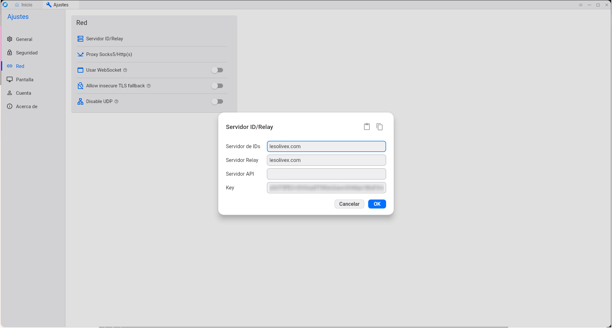

# Rustdesk self-hosted


## Iniciar en servidor

```bash
git clone git@github.com:edumag/rustdesk-self-hosted.git
cd rustdesk-self-hosted
./run
```

El script run abre el puerto 21116 y el 21117 y arranca los servicios hbbs y hbbr.

Con Ctrl-c se detienen los servicios y se cierran los puertos de nuevo.

## Instalación de cliente

sudo flatpak install RustDesk



